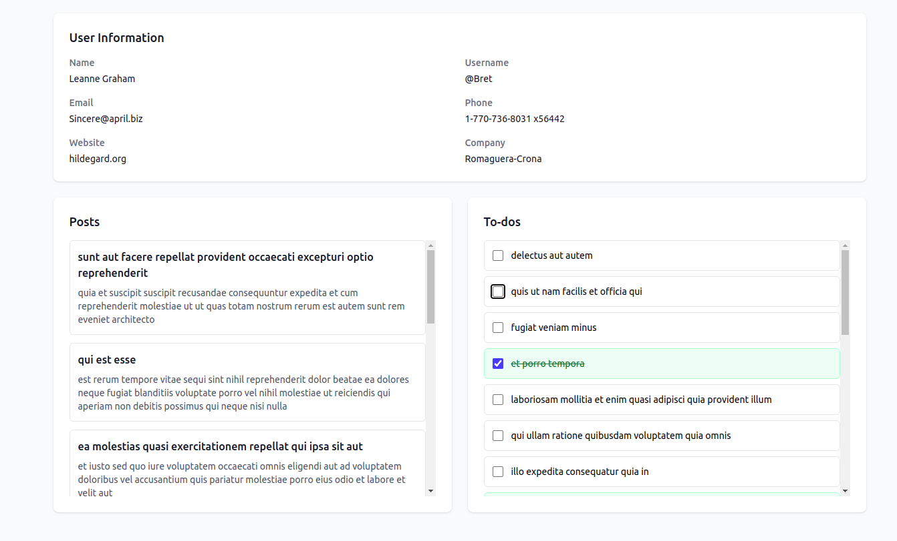

# React Dashboard Application

A complete React + TypeScript dashboard application with authentication, user management, notes, analytics, and weather widget.

## 📸 Screenshots

### Login Page

*Clean login interface with username/password authentication*

### User Detail Page

*User information page showing posts, todos, and complete user details*


### Analytics Dashboard

*Statistics showing user data, post counts, and todo completion rates*


## Features

### 🔐 Authentication
- Login page with username/password authentication
- Dummy credentials: `admin` / `admin123`
- Protected routes using React Router
- Context API for state management

### 📊 Dashboard Components

#### 1. User & Posts Manager
- Fetches users from JSONPlaceholder API using React Query
- Clickable user list with navigation to user detail pages
- User detail pages show:
  - Complete user information
  - All posts by the user
  - All todos with toggle functionality (completed/not completed)
  - Persistent todo state throughout app lifecycle

#### 2. Note Manager
- Add notes with priority levels (Important, Normal, Delayed)
- Three categorized sections for different priorities
- Delete notes functionality
- Change note priority with dropdown
- Color-coded priority system

#### 3. Simple Analytics
- Total number of users
- User with most posts (username and count)
- User with fewest posts (username and count)
- User with most completed todos (username and count)
- User with fewest completed todos (username and count)
- Styled statistics cards

#### 4. Weather Widget
- Real-time weather information using OpenWeatherMap API
- City search functionality
- Displays:
  - City name
  - Temperature in Celsius
  - Weather description
  - Humidity percentage
  - Weather icon
- Loading and error states
- Responsive design

## Tech Stack

- **React 18** with TypeScript
- **React Router** for navigation
- **React Query** for API data fetching
- **Context API** for state management
- **Tailwind CSS** for styling
- **JSONPlaceholder API** for user/posts/todos data
- **OpenWeatherMap API** for weather data

## 📷 Taking Screenshots

To add screenshots to this README:

1. **Start the application:**
   ```bash
   npm start
   ```

2. **Create screenshots directory:**
   ```bash
   mkdir screenshots
   ```

3. **Take screenshots of each page:**
   - Login page (`/login`)
   - Dashboard (`/dashboard`)
   - User detail page (`/users/1`)
   - Note manager (dashboard card)
   - Analytics (dashboard card)
   - Weather widget (dashboard card)

4. **Save screenshots as:**
   - `screenshots/login.png`
   - `screenshots/dashboard.png`
   - `screenshots/user-detail.png`
   - `screenshots/notes.png`
   - `screenshots/analytics.png`
   - `screenshots/weather.png`

## Setup Instructions

### Prerequisites
- Node.js (v14 or higher)
- npm or yarn

### Installation

1. **Clone or navigate to the project directory:**
   ```bash
   cd /home/mahmoudshakour/hankasha/react-project
   ```

2. **Install dependencies:**
   ```bash
   npm install
   ```

3. **Set up Weather API (Optional):**
   - Get a free API key from [OpenWeatherMap](https://openweathermap.org/api)
   - Replace `YOUR_API_KEY_HERE` in `src/components/WeatherWidget.tsx` with your actual API key
   - If you don't set up the API key, the weather widget will show a placeholder message

4. **Start the development server:**
   ```bash
   npm start
   ```

5. **Open your browser:**
   Navigate to `http://localhost:3000`

## Usage

### Login
- Use credentials: `admin` / `admin123`
- After successful login, you'll be redirected to the dashboard

### Dashboard Navigation
- **User & Posts Manager**: Click on any user to view their details, posts, and todos
- **Note Manager**: Add notes with different priorities and manage them
- **Analytics**: View user statistics and post/todo analytics
- **Weather Widget**: Search for weather information by city name

### User Detail Page
- View complete user information
- Browse all posts by the user
- Manage todos with click-to-toggle functionality
- Todo completion state persists throughout the app

## 🏗️ App Architecture


## Project Structure

```
src/
├── components/          # React components
│   ├── Login.tsx       # Login page
│   ├── Dashboard.tsx   # Main dashboard
│   ├── UserDetail.tsx  # User detail page
│   ├── UserPostsManager.tsx
│   ├── NoteManager.tsx
│   ├── Analytics.tsx
│   └── WeatherWidget.tsx
├── context/            # Context providers
│   ├── AuthContext.tsx
│   ├── NoteContext.tsx
│   └── TodoContext.tsx
├── types/              # TypeScript type definitions
│   └── index.ts
├── App.tsx             # Main app component with routing
├── index.tsx           # App entry point
└── index.css           # Global styles with Tailwind
```

## API Endpoints Used

- **JSONPlaceholder API:**
  - Users: `https://jsonplaceholder.typicode.com/users`
  - Posts: `https://jsonplaceholder.typicode.com/posts`
  - Todos: `https://jsonplaceholder.typicode.com/todos`

- **OpenWeatherMap API:**
  - Weather: `https://api.openweathermap.org/data/2.5/weather`

## Features Implemented

✅ Login page with authentication  
✅ Protected routes  
✅ Dashboard with four feature cards  
✅ User & Posts Manager with React Query  
✅ User detail pages with posts and todos  
✅ Todo toggle functionality with persistent state  
✅ Note Manager with priority system  
✅ Analytics dashboard with user statistics  
✅ Weather Widget with API integration  
✅ Responsive design with Tailwind CSS  
✅ TypeScript throughout the application  
✅ Context API for state management  

## Development

The app is built with modern React patterns and best practices:
- Functional components with hooks
- TypeScript for type safety
- Context API for global state
- React Query for server state management
- Tailwind CSS for styling
- Responsive design principles

## Browser Support

The application supports all modern browsers including:
- Chrome (latest)
- Firefox (latest)
- Safari (latest)
- Edge (latest)
